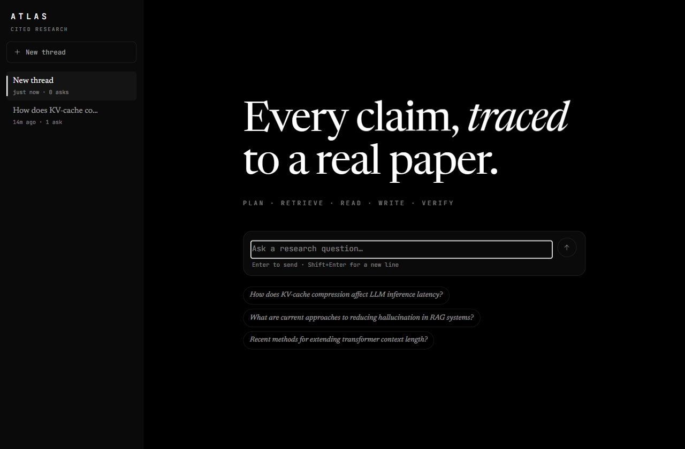
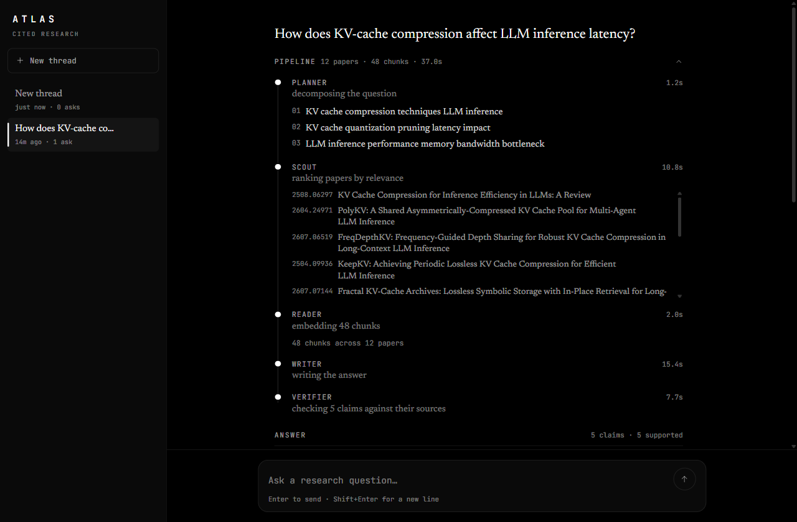
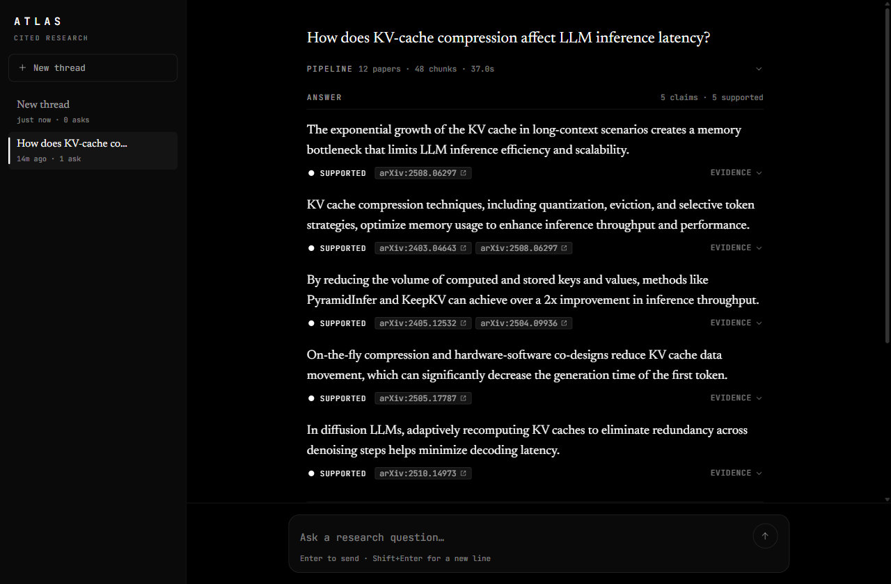

# Atlas

Ask a research question. Atlas retrieves real arXiv papers, writes a short answer grounded in what it read, and checks every citation against the source before showing you anything.

Most assistants answer research questions from memory and invent citations when they're unsure. Atlas does the opposite: it plans sub-questions, searches arXiv, reads the abstracts, drafts a survey-style answer where every claim carries a citation, and then a separate verifier audits each claim against the exact text it cites. Claims that aren't supported are flagged — never quietly dropped.



## How it works

A small hand-written pipeline runs each question through five stages, streamed to the browser as they happen:

1. **Planner** — breaks the question into focused sub-queries.
2. **Scout** — searches arXiv per sub-query, dedupes, and reranks by embedding similarity.
3. **Reader** — chunks and embeds the abstracts, ranked against the question.
4. **Writer** — drafts an answer where every claim points at the chunks that support it.
5. **Verifier** — independently re-checks each claim against its cited text: supported, partial, or unsupported.

The interface shows the pipeline working in real time, then the answer — each claim tagged with its verdict, linked to the papers it draws on, with the exact supporting passage one click away. Threads are kept locally so you can follow several lines of inquiry.

Every stage is visible, with real timings and the papers it pulled:



The answer, with each claim carrying its citations and verification verdict:



## Stack

- Next.js (App Router, TypeScript) and Tailwind CSS
- Gemini for planning, writing, and verification; Gemini embeddings for retrieval
- arXiv API for papers
- Server-Sent Events to stream pipeline progress

## Run it

```bash
pnpm install
cp .env.example .env.local   # add your GEMINI_API_KEY
pnpm dev
```

Open http://localhost:3000 and ask a question. You can also hit the pipeline directly:
`http://localhost:3000/api/search?q=kv+cache+compression` returns ranked papers as JSON.

## Evaluation

Retrieval quality and citation accuracy are being measured on a curated question set; a public writeup of the method and the numbers is in progress.
